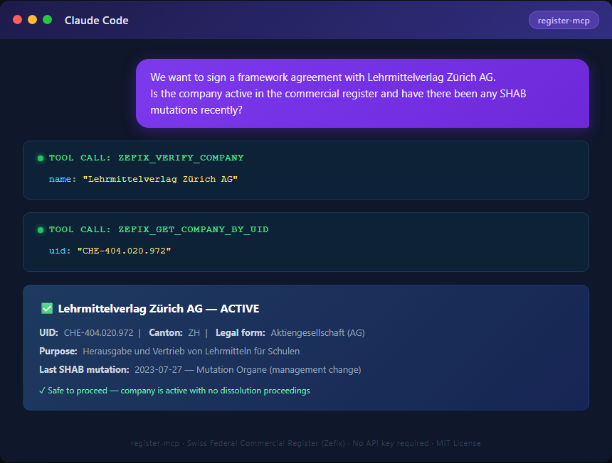

[🇬🇧 English Version](README.md)

> 🇨🇭 **Teil des [Swiss Public Data MCP Portfolios](https://github.com/malkreide)**

# 🏛️ register-mcp


[](https://opensource.org/licenses/MIT)
[](https://www.python.org/downloads/)
[](https://modelcontextprotocol.io/)
[](https://github.com/malkreide/register-mcp)


> MCP-Server für das Schweizer Handelsregister (Zefix) und ergänzende Referenzdaten

---

## Übersicht

`register-mcp` ermöglicht KI-Assistenten den direkten Zugang zum Schweizer Handelsregister via Zefix REST API — ohne Authentifizierung:

| Quelle | Daten | API |
|--------|-------|-----|
| **Zefix (Handelsregister)** | Schweizer Firmen, Rechtsformen, SHAB-Mutationen | ZefixREST v1 |
| **SHAB** | Schweizerisches Handelsamtsblatt — Mutationspublikationen | In Zefix eingebettet |

Entwickelt für den Einsatz in der öffentlichen Verwaltung: Lieferantenprüfung, Vertragspartner-Due-Diligence, Beschaffungs-Screening und Lieferanten-Onboarding — alles via natürlichsprachliche Abfragen.

**Anker-Demo-Abfrage:** *«Wir möchten mit dem Lehrmittelverlag Zürich AG einen Rahmenvertrag abschliessen. Ist die Firma im Handelsregister aktiv eingetragen, welchen Gesellschaftszweck hat sie, und gab es in den letzten zwei Jahren SHAB-Mutationen?»*

---

## Funktionen

- 🏛️ **6 Tools** für Firmensuche, Verifizierung und Referenzdaten
- 🔍 **`zefix_verify_company`** — Schnell-Check: aktiv oder gelöscht?
- 🌐 **Zweisprachige Ausgabe** (Markdown / JSON)
- 🔓 **Kein API-Schlüssel erforderlich** — offene Daten von zefix.admin.ch
- ☁️ **Dualer Transport** — stdio (Claude Desktop) + SSE (Cloud)

---

## Voraussetzungen

- Python 3.11+
- [uv](https://github.com/astral-sh/uv) (empfohlen) oder pip

---

## Installation

```bash
# Repository klonen
git clone https://github.com/malkreide/register-mcp.git
cd register-mcp

# Installieren
pip install -e .
# oder mit uv:
uv pip install -e .
```

Oder mit `uvx` (ohne dauerhafte Installation):

```bash
uvx register-mcp
```

---

## Schnellstart

```bash
# stdio (für Claude Desktop)
python -m register_mcp.server

# SSE (Cloud-Deployment)
MCP_TRANSPORT=sse PORT=8000 python -m register_mcp.server
```

Sofort in Claude Desktop ausprobieren:

> *«Ist der Lehrmittelverlag Zürich AG im Handelsregister aktiv?»*
> *«Suche die Firma mit UID CHE-108.954.978»*
> *«Liste alle Schweizer Rechtsformen auf»*

---

## Konfiguration

### Claude Desktop

Editiere `~/Library/Application Support/Claude/claude_desktop_config.json` (macOS) bzw. `%APPDATA%\Claude\claude_desktop_config.json` (Windows):

```json
{
  "mcpServers": {
    "register": {
      "command": "python",
      "args": ["-m", "register_mcp.server"]
    }
  }
}
```

Oder mit `uvx`:

```json
{
  "mcpServers": {
    "register": {
      "command": "uvx",
      "args": ["register-mcp"]
    }
  }
}
```

**Pfad zur Konfigurationsdatei:**
- macOS: `~/Library/Application Support/Claude/claude_desktop_config.json`
- Windows: `%APPDATA%\Claude\claude_desktop_config.json`

### Cloud-Deployment (SSE für Browser-Zugriff)

Für den Einsatz via **claude.ai im Browser** (z.B. auf verwalteten Arbeitsplätzen ohne lokale Software-Installation):

**Render.com (empfohlen):**
1. Repository auf GitHub pushen/forken
2. Auf [render.com](https://render.com): New Web Service → GitHub-Repo verbinden
3. Start-Befehl setzen: `python -m register_mcp.server --http --port 8000`
4. In claude.ai unter Settings → MCP Servers eintragen: `https://your-app.onrender.com/sse`

> 💡 *«stdio für den Entwickler-Laptop, SSE für den Browser.»*

---

## Verfügbare Tools

| Tool | Beschreibung |
|------|-------------|
| `zefix_search_companies` | Firmen nach Name, Kanton, Rechtsform suchen |
| `zefix_get_company` | Vollständiges Firmenprofil per EHRAID |
| `zefix_get_company_by_uid` | Firmendetails per UID (CHE-xxx.xxx.xxx) |
| `zefix_verify_company` | Schnell-Check: aktiv oder gelöscht? |
| `zefix_list_legal_forms` | Alle Schweizer Rechtsformen mit IDs |
| `zefix_list_municipalities` | Schweizer Gemeinden mit BFS-IDs |

### Beispiel-Abfragen

| Abfrage | Tool |
|---------|------|
| *«Ist der Lehrmittelverlag Zürich AG aktiv?»* | `zefix_verify_company` |
| *«Suche CHE-108.954.978»* | `zefix_get_company_by_uid` |
| *«Finde Firmen namens Migros im Kanton ZH»* | `zefix_search_companies` |
| *«Liste alle Schweizer Rechtsformen»* | `zefix_list_legal_forms` |
| *«Zeige Gemeinden im Kanton Bern»* | `zefix_list_municipalities` |

---

## Architektur

```
┌─────────────────┐     ┌──────────────────────────────┐     ┌──────────────────────────┐
│   Claude / KI   │────▶│       register-mcp            │────▶│  Zefix (Handelsregister)  │
│   (MCP Host)    │◀────│       (MCP Server)            │◀────│  ZefixREST/api/v1        │
└─────────────────┘     │                              │     └──────────────────────────┘
                        │  6 Tools                     │
                        │  Stdio | SSE                 │
                        │  Keine Authentifizierung     │
                        └──────────────────────────────┘
```

### Datenquellen-Übersicht

| Quelle | Protokoll | Umfang | Auth |
|--------|-----------|--------|------|
| Zefix (Phase 1) | REST/JSON | Schweizer Firmen, Rechtsformen, SHAB | Keine |
| ZefixPublicREST (Phase 2) | REST/JSON | Zeichnungsberechtigte, Kapital, Historie | Basic Auth (kostenlos) |
| UID-Register (Phase 3) | SOAP | MWST, NOGA-Codes, registerübergreifend | Öffentlich (20 Req/min) |

---

## Phasen-Roadmap

| Phase | API | Auth | Status |
|-------|-----|------|--------|
| **Phase 1** | `ZefixREST/api/v1` | Keine | **Aktuell** |
| **Phase 2** | `ZefixPublicREST/api/v1` | Basic Auth (kostenlos, zefix@bj.admin.ch) | Geplant |
| **Phase 3** | UID-Register SOAP | Öffentlich (20 Req/min) | Geplant |

Phase 2 ergänzt: Zeichnungsberechtigte, Stammkapital, vollständige Mutationshistorie.
Phase 3 ergänzt: MWST-Status, NOGA-Branchencodes, registerübergreifende Validierung.

---

## Projektstruktur

```
register-mcp/
├── src/register_mcp/
│   ├── __init__.py              # Package
│   └── server.py                # 6 Tools (Zefix + Referenzdaten)
├── tests/
│   └── test_server.py           # Unit + Integrationstests (gemockt)
├── docs/demo/
│   ├── demo.tape                # vhs-Aufnahme-Script → demo.gif
│   ├── demo.py                  # Standalone CLI-Demo (Live Zefix API)
│   └── README.md                # Anleitung zur GIF-Generierung
├── .github/workflows/ci.yml     # GitHub Actions (Python 3.11/3.12/3.13)
├── pyproject.toml
├── CHANGELOG.md
├── CONTRIBUTING.md
├── LICENSE
├── README.md                    # Englische Hauptversion
└── README.de.md                 # Diese Datei (Deutsch)
```

---

## Bekannte Einschränkungen

- Suche nach Kanton ohne Namensfilter kann zu API-Fehlern führen (Zefix-Limitation)
- SHAB-Publikationstexte enthalten XML-Markup (`<FT TYPE="F">...`)
- Phase-1-API kann bei hoher Last gedrosselt werden; kurz warten und erneut versuchen
- ZefixPublicREST (neue API) erfordert Registrierung: E-Mail an zefix@bj.admin.ch

---

## Sicherheit & Grenzen

### Rate Limits

| API | Limit | Hinweis |
|-----|-------|---------|
| ZefixREST (Phase 1) | Nicht offiziell dokumentiert | Drosselung bei hoher Last möglich — 1–2 s warten und erneut versuchen |
| ZefixPublicREST (Phase 2) | Nicht offiziell dokumentiert | Vorab-Registrierung erforderlich (kostenlos) |
| UID-Register SOAP (Phase 3) | **20 Req/min** | Hartes Limit, öffentlich dokumentiert |

### Datenschutz

- **Schreibgeschützt** — alle Tools tragen `readOnlyHint: True`; der Server führt keine Schreib-, Lösch- oder Mutationsoperationen gegen eine API durch
- **Keine Datenspeicherung** — der Server agiert als zustandsloser Proxy; keine Firmendaten werden persistent gespeichert, gecacht oder geloggt
- **Nur öffentliche Registerdaten** — das Zefix-Handelsregister ist ein öffentliches Bundesregister (HRegV); zurückgegebene Daten sind gesetzlich öffentliche Informationen, keine Personendaten im Sinne des DSG
- **Kein Nutzer-Tracking** — der Server überträgt keine Nutzeridentität, Abfragehistorie oder Sitzungsdaten an zefix.admin.ch

### Nutzungsbedingungen & Datenquellen

- **Zefix API:** Die Nutzung der Zefix REST API unterliegt den [Nutzungsbedingungen von zefix.admin.ch](https://www.zefix.admin.ch). Die Daten werden unter den Grundsätzen von [Open Government Data (OGD) Schweiz](https://opendata.swiss/) veröffentlicht.
- **SHAB:** Schweizerisches Handelsamtsblatt — veröffentlicht durch die Bundeskanzlei (BK). Gesetzlich öffentlich.
- **Institutioneller Einsatz:** Dieser Server ist für schreibgeschützte Abfragen in Verwaltungsworkflows konzipiert. Nicht geeignet für Massen-Harvesting oder automatisierte Überwachungsanwendungen.

### Sicherheit

- Keine Credentials gespeichert oder übertragen (Phase 1)
- Phase-2-Credentials (`ZEFIX_USER`, `ZEFIX_PASSWORD`) nur via Umgebungsvariablen — nie hardcodiert
- Alle HTTP-Aufrufe ausschliesslich via HTTPS
- Tool-Inputs werden via Pydantic v2 validiert, bevor ein API-Aufruf erfolgt

---

## Demo



> 📽️ *Terminal-GIF folgt — siehe [`docs/demo/`](docs/demo/) zur lokalen Generierung mit [vhs](https://github.com/charmbracelet/vhs)*

**Beispiel-Interaktion:**

```
Benutzer: «Ist der Lehrmittelverlag Zürich AG im Handelsregister aktiv?»

→ Tool: zefix_verify_company(name="Lehrmittelverlag Zürich AG")

Claude: ✅ Lehrmittelverlag Zürich AG ist AKTIV im Handelsregister.
        UID: CHE-109.741.634 | Kanton: ZH | Rechtsform: AG
        Letzte SHAB-Mutation: 2024-06-15
```

[→ Weitere Anwendungsbeispiele nach Zielgruppe →](EXAMPLES.md)

Demo-GIF lokal generieren:

```bash
# vhs installieren (macOS/Linux)
brew install vhs        # macOS
# oder: go install github.com/charmbracelet/vhs@latest

# Generieren
vhs docs/demo/demo.tape
# → erzeugt docs/demo/demo.gif
```

---

## Tests

```bash
# Unit-Tests (kein API-Key erforderlich)
PYTHONPATH=src pytest tests/ -m "not live"

# Integrationstests (Live-API-Aufrufe)
pytest tests/ -m "live"
```

---

## Changelog

Siehe [CHANGELOG.md](CHANGELOG.md)

---

## Mitwirken

Siehe [CONTRIBUTING.md](CONTRIBUTING.md)

---

## Lizenz

MIT-Lizenz — siehe [LICENSE](LICENSE)

---

## Autor

Hayal Oezkan · [malkreide](https://github.com/malkreide)

---

## Credits & Verwandte Projekte

- **Zefix:** [zefix.admin.ch](https://www.zefix.admin.ch/) — Eidg. Handelsregister (BJ)
- **SHAB:** Schweizerisches Handelsamtsblatt — Mutationspublikationen
- **Protokoll:** [Model Context Protocol](https://modelcontextprotocol.io/) — Anthropic / Linux Foundation
- **Verwandt:** [fedlex-mcp](https://github.com/malkreide/fedlex-mcp) — Handelsregisterverordnung (HRegV)
- **Verwandt:** [zurich-opendata-mcp](https://github.com/malkreide/zurich-opendata-mcp) — Firmensitz + Geodaten
- **Verwandt:** [swiss-statistics-mcp](https://github.com/malkreide/swiss-statistics-mcp) — Branchenstatistiken per NOGA
- **Verwandt:** [swiss-snb-mcp](https://github.com/malkreide/swiss-snb-mcp) — Wirtschaftsindikatoren
- **Portfolio:** [Swiss Public Data MCP Portfolio](https://github.com/malkreide)
