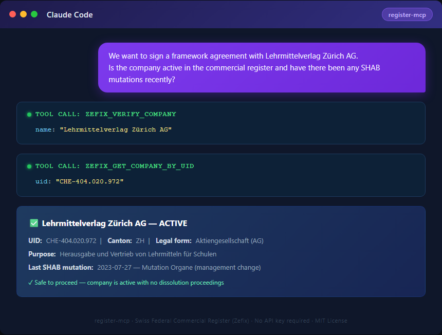

[🇬🇧 English Version](README.md)

> 🇨🇭 **Teil des [Swiss Public Data MCP Portfolios](https://github.com/malkreide)**

# register-mcp


[](https://opensource.org/licenses/MIT)
[](https://www.python.org/downloads/)
[](https://modelcontextprotocol.io/)
[](https://github.com/malkreide/register-mcp)


> MCP-Server für das Schweizer Handelsregister (Zefix), mit einem **Firmen-UID-Join** zum Amtsblattportal (SHAB + kantonale Amtsblätter)

---

## Übersicht

`register-mcp` ermöglicht KI-Assistenten den direkten Zugang zu **zwei** eidgenössischen Datenquellen, verknüpft über die UID — ohne Authentifizierung:

| Quelle | Daten | API |
|--------|-------|-----|
| **Zefix (Handelsregister)** | Schweizer Firmen, Rechtsformen, Sitzangaben | ZefixREST v1 |
| **Amtsblattportal** | Alles, was **über eine bestimmte Firma** (per UID) publiziert wurde: HR-Mutationen, Schuldenrufe, Konkurse | amtsblattportal.ch v1 |

Beide Quellen teilen einen Schlüssel — die **UID**. Der Mehrwert liegt im Join: **Zefix sagt, ob eine Firma existiert. Das Amtsblatt sagt, was über sie publiziert wurde.**

Der Amtsblatt-Zugang ist hier bewusst **firmenbezogen** — der Einstieg erfolgt ausschliesslich über eine Firmen-UID oder eine konkrete Publikations-ID. Es gibt **keinen Volltext- oder Personen-Sucheinstieg** in diesem Server; ein solcher wäre ein Profiling-Werkzeug über die personendatenlastigen Rubriken des Amtsblatts (Konkurse, Schuldbetreibungen, Erbschaft). Die breite Amtsblatt-Plattformsuche (Beschaffung, kantonale Bekanntmachungen, Volltext) ist als eigener `amtsblatt-mcp` vorgeschlagen — siehe [`docs/amtsblatt-mcp-proposal.md`](docs/amtsblatt-mcp-proposal.md) und den Abschnitt **Datenschutz & Scope** unten.

Entwickelt für den Einsatz in der öffentlichen Verwaltung: Lieferantenprüfung, Vertragspartner-Due-Diligence und Lieferanten-Onboarding — alles via natürlichsprachliche Abfragen.

**Anker-Demo-Abfrage:** *«Bevor wir mit der Lehrmittelverlag Zürich AG einen Rahmenvertrag abschliessen: Ist die Firma im Handelsregister aktiv, wie lautet ihre UID und ihr Zweck — und was hat das Amtsblatt über genau diese UID publiziert (HR-Mutationen, Schuldenrufe, allfällige Konkurse)?»*

Diese eine Frage durchläuft die ganze Tool-Kette über beide Quellen:

```
zefix_search_company  →  zefix_verify_company  →  gazette_company_publications(uid=…)  →  gazette_get_publication(id=…)
```

---

## Funktionen

- 🏛️ **9 Tools** über zwei Quellen — Firmensuche & Verifizierung (Zefix) + firmenbezogener Amtsblatt-Join (SHAB/kantonal)
- 🔗 **`gazette_company_publications`** — der UID-Join: alles, was über eine Firma publiziert wurde
- 🛡️ **Datenschutzsicher by design** — die einzigen Amtsblatt-Einstiege sind UID- oder ID-bezogen; kein Personen-Sucheinstieg existiert (siehe *Datenschutz & Scope*)
- 🔍 **`zefix_verify_company`** — Schnell-Check: aktiv oder gelöscht?
- 🌐 **Zweisprachige Ausgabe** (Markdown / JSON) mit Quellenangabe je Datenquelle + `provenance`
- 🔓 **Kein API-Schlüssel erforderlich** — offene Daten von zefix.admin.ch und amtsblattportal.ch
- ☁️ **Dualer Transport** — stdio (Claude Desktop) + SSE (Cloud)

---

## Voraussetzungen

- Python 3.11+
- [uv](https://github.com/astral-sh/uv) (empfohlen) oder pip

---

## Installation

```bash
# Repository klonen
git clone https://github.com/malkreide/register-mcp.git
cd register-mcp

# Installieren
pip install -e .
# oder mit uv:
uv pip install -e .
```

Oder mit `uvx` (ohne dauerhafte Installation):

```bash
uvx register-mcp
```

---

## Schnellstart

```bash
# stdio (für Claude Desktop)
python -m register_mcp.server

# SSE (Cloud-Deployment) — MCP_API_KEY ist ERFORDERLICH
MCP_API_KEY=$(openssl rand -hex 32) MCP_TRANSPORT=sse PORT=8000 \
  python -m register_mcp.server
```

### SSE / Cloud-Deployment

Beim Betrieb mit `MCP_TRANSPORT=sse` erzwingt der Server:

- **Bearer-Token-Auth** — setze `MCP_API_KEY` auf eine geheime Zeichenkette. Clients müssen
  bei jeder Anfrage `Authorization: Bearer <key>` senden. Fehlt der Header oder ist er falsch → HTTP 401.
  Der Server startet nicht ohne gesetztes `MCP_API_KEY`.
- **Rate Limiting** — gleitendes Fenster pro Bearer-Token-Hash. Standard: 60 Req / 60 s.
  Einstellbar via `MCP_RATE_LIMIT` und `MCP_RATE_WINDOW`. Bei Überschreitung folgt
  HTTP 429 mit `Retry-After`.
- **Strukturiertes JSON-Logging** — jeder Tool-Aufruf gibt eine Zeile auf stderr aus mit
  `tool`, `status`, `latency_ms`. Auth-Fehler und Rate-Limit-Ereignisse werden auf
  WARNING-Level geloggt. Verbosität via `LOG_LEVEL` (Standard `INFO`) konfigurieren.
- **Referenzdaten-Cache** — Zefix-Rechtsformen werden 24h gecacht
  (`LEGAL_FORMS_TTL` Sekunden), um einen zusätzlichen Upstream-Aufruf pro Tool-Aufruf zu vermeiden.
- **Egress-Allow-List** — ausgehendes HTTP ist auf `www.zefix.admin.ch` und
  `amtsblattportal.ch` beschränkt via einen `httpx`-Request-Hook, der auch bei
  Redirects greift. Ein `Location`-Header, der woanders hinzeigt, löst
  `EgressDenied` aus und wird nie befolgt. Überschreibbar via
  `MCP_ALLOWED_HOSTS=host1,host2` (kommagetrennt, klein geschrieben).

  > ⚠️ **Upgrade-Hinweis (0.2.x → 0.3.0):** `amtsblattportal.ch` wurde beim Start
  > der Amtsblatt-Tools zur **Default**-Allow-List hinzugefügt. Falls dein
  > Deployment `MCP_ALLOWED_HOSTS` **fest gesetzt** hat, überschreibt dieser Wert
  > den Default vollständig — ergänze `amtsblattportal.ch`, sonst wirft jeder
  > `gazette_*`-Aufruf `EgressDenied`.
- **Optionales OpenTelemetry-Tracing** — Installation via `pip install register-mcp[otel]`
  und Setzen von `OTEL_EXPORTER_OTLP_ENDPOINT` (z.B. `http://otel-collector:4318/v1/traces`).
  Ohne das Extra oder ohne die Umgebungsvariable bleibt der Server still — keine harte
  Abhängigkeit zum OTel-SDK.

Für Multi-Instanz-Deployments gehört ein echtes Gateway (Cloudflare, Railway Internal
Networking, ein API-Gateway mit Redis-basiertem Rate Limiting) vor den
In-Memory-Limiter, der prinzipbedingt pro Prozess arbeitet.

### Container-Deployment

Ein minimales Multi-Stage-`Dockerfile` liegt dem Repo bei. Das Image läuft als
Non-Root-User `mcp`; Abhängigkeiten werden aus `uv.lock` aufgelöst (`uv sync
--frozen`), der Build ist also reproduzierbar.

```bash
docker build -t register-mcp:local .

docker run --rm -p 8000:8000 \
  -e MCP_TRANSPORT=sse \
  -e MCP_API_KEY="$(openssl rand -hex 32)" \
  register-mcp:local
```

Für die lokale Iteration gibt es eine `compose.yaml` mit `read_only`, `cap_drop: ALL`
und `no-new-privileges`:

```bash
MCP_API_KEY=$(openssl rand -hex 32) docker compose up --build
```

Siehe [SECURITY.md](SECURITY.md) für Hardening-Hinweise (Egress-Beschränkung,
Schlüsselrotation, SIEM-Weiterleitung).

Sofort in Claude Desktop ausprobieren:

> *«Ist der Lehrmittelverlag Zürich AG im Handelsregister aktiv?»*
> *«Suche die Firma mit UID CHE-108.954.978»*
> *«Liste alle Schweizer Rechtsformen auf»*

---

## Konfiguration

### Claude Desktop

Editiere `~/Library/Application Support/Claude/claude_desktop_config.json` (macOS) bzw. `%APPDATA%\Claude\claude_desktop_config.json` (Windows):

```json
{
  "mcpServers": {
    "register": {
      "command": "python",
      "args": ["-m", "register_mcp.server"]
    }
  }
}
```

Oder mit `uvx`:

```json
{
  "mcpServers": {
    "register": {
      "command": "uvx",
      "args": ["register-mcp"]
    }
  }
}
```

**Pfad zur Konfigurationsdatei:**
- macOS: `~/Library/Application Support/Claude/claude_desktop_config.json`
- Windows: `%APPDATA%\Claude\claude_desktop_config.json`

### Cloud-Deployment (SSE für Browser-Zugriff)

Für den Einsatz via **claude.ai im Browser** (z.B. auf verwalteten Arbeitsplätzen ohne lokale Software-Installation):

**Render.com (empfohlen):**
1. Repository auf GitHub pushen/forken
2. Auf [render.com](https://render.com): New Web Service → GitHub-Repo verbinden
3. Start-Befehl setzen: `python -m register_mcp.server --http --port 8000`
4. In claude.ai unter Settings → MCP Servers eintragen: `https://your-app.onrender.com/sse`

> 💡 *«stdio für den Entwickler-Laptop, SSE für den Browser.»*

---

## Verfügbare Tools

**Zefix — Handelsregister (6):**

| Tool | Beschreibung |
|------|-------------|
| `zefix_search_companies` | Firmen nach Name, Kanton, Rechtsform suchen |
| `zefix_get_company` | Vollständiges Firmenprofil per EHRAID |
| `zefix_get_company_by_uid` | Firmendetails per UID (CHE-xxx.xxx.xxx) |
| `zefix_verify_company` | Schnell-Check: aktiv oder gelöscht? |
| `zefix_list_legal_forms` | Alle Schweizer Rechtsformen mit IDs |
| `zefix_list_municipalities` | Schweizer Gemeinden mit BFS-IDs |

**Amtsblattportal — der firmenbezogene Amtsblatt-Join (3):**

| Tool | Beschreibung |
|------|-------------|
| `gazette_company_publications` | **Der UID-Join.** Alle Amtsblatt-Publikationen zu einer Firmen-**UID**, neueste zuerst, optionale (validierte) Rubrik-/Zeitfilter |
| `gazette_get_publication` | Einzelpublikation inkl. XML-Volltext, defensiv geparst (per Publikations-ID) |
| `gazette_source_status` | Erreichbarkeit beider Quellen + Cache-Alter (Rubriken, Rechtsformen) |

Der Prefix ist `gazette_` und nicht `shab_`, weil die Quelle SHAB **und** die kantonalen Amtsblätter umfasst. Jeder Einstieg ist UID- oder ID-bezogen — siehe **Datenschutz & Scope**. Die breite, nicht-firmenbezogene Amtsblatt-Suche (Beschaffung, kantonaler Volltext) ist dem separaten [`amtsblatt-mcp`](docs/amtsblatt-mcp-proposal.md) zugeordnet.

### Beispiel-Abfragen

| Abfrage | Tool |
|---------|------|
| *«Ist der Lehrmittelverlag Zürich AG aktiv?»* | `zefix_verify_company` |
| *«Suche CHE-108.954.978»* | `zefix_get_company_by_uid` |
| *«Finde Firmen namens Migros im Kanton ZH»* | `zefix_search_companies` |
| *«Was wurde über CHE-116.115.052 publiziert?»* | `gazette_company_publications` |
| *«Zeig mir den amtlichen Volltext dieser HR-Löschung»* | `gazette_get_publication` |
| *«Sind beide Datenquellen gerade erreichbar?»* | `gazette_source_status` |

---

## Architektur

```
                                                          ┌──────────────────────────────┐
                                                    ┌────▶│  Zefix (Handelsregister)     │
                                                    │     │  www.zefix.admin.ch          │
┌─────────────────┐     ┌──────────────────────────┴─┐   │  ZefixREST/api/v1            │
│   Claude / KI   │────▶│       register-mcp           │   └──────────────────────────────┘
│   (MCP Host)    │◀────│       (MCP Server)           │   ┌──────────────────────────────┐
└─────────────────┘     │  9 Tools (zefix_ + gazette_) ├──▶│  Amtsblattportal             │
                        │  Stdio | SSE                 │   │  amtsblattportal.ch/api/v1   │
                        │  Egress-Allow-List           │   │  SHAB + kantonale Amtsblätter │
                        │  Keine Authentifizierung     │   └──────────────────────────────┘
                        └──────────────────────────────┘
                              Join-Schlüssel: UID (CHE-XXX.XXX.XXX)
```

### Datenquellen-Übersicht

| Quelle | Protokoll | Umfang | Auth |
|--------|-----------|--------|------|
| Zefix | REST/JSON | Schweizer Firmen, Rechtsformen, Sitzangaben | Keine |
| Amtsblattportal | REST/JSON (Liste) + XML (Volltext) | SHAB + kantonale Amtsblätter, 2.79 Mio. Publikationen | Keine |
| ZefixPublicREST (geplant) | REST/JSON | Zeichnungsberechtigte, Kapital, Historie | Basic Auth (kostenlos) |
| UID-Register (geplant) | SOAP | MWST, NOGA-Codes, registerübergreifend | Öffentlich (20 Req/min) |

### Der UID-Join — Zefix ↔ Amtsblatt

Beide Quellen teilen genau einen Schlüssel: die **UID** (`CHE-XXX.XXX.XXX`).
Erst dadurch werden aus zwei Datensätzen ein Arbeitsablauf.

```
zefix_get_company_by_uid(uid)        # Zefix: existiert die Firma? Status, Zweck, Rechtsform
        │  UID
        ▼
gazette_company_publications(uid)    # Amtsblatt: alles Publizierte (HR, KK, SB, LS, …)
        │  Publikations-ID
        ▼
gazette_get_publication(id)          # Amtlicher Volltext aus dem rubrikspezifischen XML
```

Zwei Eigenschaften der Quelle prägen diesen Pfad (beide belegt in
[`docs/probe-shab.md`](docs/probe-shab.md)):

- Die **Bulk-Liste enthält keine Firmen-UID** (`meta.uid` ist `null`). Die
  Firmen-UID steht erst im **Einzelabruf** — `meta.uid` im Einzel-JSON bzw.
  `<uid>` im XML (das auch den Volltext trägt). Der Join läuft also
  *Liste → Einzelabruf je Treffer → Abgleich mit der Zefix-UID*.
- `gazette_company_publications` filtert direkt per `uids=<UID>`, liefert die
  Publikationen einer Firma also in einem Aufruf, ohne jeden Datensatz zu
  durchlaufen.

### Beschaffung liegt im separaten `amtsblatt-mcp`

Öffentliche Beschaffung (Submissionen) ist **keine** föderale SHAB-Rubrik und
wird von diesem Server **nicht** abgedeckt. Sie existiert nur als **kantonale**
`OB-<Kanton>`-Rubrik, nur wenige Kantone publizieren sie in diesem Portal, und
die meisten — inklusive **Zürich** — laufen über
**[simap.ch](https://www.simap.ch/)**, eine separate Plattform. Beschaffung,
kantonale Bekanntmachungen und breite Volltextsuche sind dem vorgeschlagenen
[`amtsblatt-mcp`](docs/amtsblatt-mcp-proposal.md) zugeordnet, der eine
fail-closed **grüne Rubriken-Allow-List** anwendet. Die vollständige
`OB-*`-Abdeckungskarte und die Rubriken-Ampeltabelle stehen in jenem Proposal.

> **`SB` ≠ Submissionen.** `SB` steht für *Schuldbetreibungen* — eine
> personendatenlastige Rubrik, die dieser Server nie als Sucheinstieg exponiert.

---

## Datenschutz & Scope

Dieser Abschnitt ist **keine** Fussnote — er ist der Grund, warum der Server so
geschnitten ist, wie er ist.

Das Amtsblattportal publiziert systematisch Rubriken mit Personendaten
**natürlicher** Personen: Konkurse (`KK`), Schuldbetreibungen (`SB`),
Schuldenrufe (`LS`/`SR`), Erbschafts-/Nachlassaufrufe (`ES`, `TE-*`) und
Baugesuche mit Eigentümernamen. Diese Publikationen sind öffentlich — sie aber
über einen KI-Agenten *systematisch nach Namen abfragbar* zu machen, ist eine
Zweckentfremdung, welche die Publikation nie beabsichtigt hat; unter dem
revidierten Datenschutzgesetz (**revDSG**) ist ein Werkzeug «zeig mir alle
Betreibungen zu Person X» ein Profiling-Instrument. Daraus folgen bewusste
Design-Entscheide:

- **Kein personenbezogener Sucheinstieg.** Kein Tool nimmt Name, Geburtsdatum
  oder Adresse einer natürlichen Person entgegen. Die einzigen Amtsblatt-
  Einstiege sind über eine **Firmen-UID** (`gazette_company_publications`) oder
  eine opake **Publikations-ID** (`gazette_get_publication`) gekeyt. Der Konkurs
  *einer Firma* wird über deren UID zurückgegeben — das sind Unternehmensdaten
  einer juristischen Person, kein namensbasiertes Profiling.
- **Keine Volltext-Amtsblattsuche hier.** `keyword` und `cantons` stehen nicht
  einmal auf der internen Query-Parameter-Allow-List, sodass keine künftige
  Code-Änderung eine korpusweite Stichwortsuche einschmuggeln kann. Breite Suche
  liegt im `amtsblatt-mcp` hinter einer fail-closed grünen Allow-List
  (nur Beschaffung, HR, amtliche Bekanntmachungen).
- **Keine Persistenz von Meldungsinhalten.** Der Server ist Pass-through; nur die
  Rubriken-Taxonomie und die Zefix-Rechtsformen werden 24 h im Speicher gecacht.
  Amtliche Publikationen haben gesetzliche Löschfristen — ein Speicher, der sie
  überdauert, würde diese Fristen aktiv unterlaufen.
- **Fail closed.** Rubrik-Codes werden vor jedem Call gegen die Live-Taxonomie
  validiert; ein unbekannter Code wird abgewiesen, nicht still ausgeweitet.

Das breite Plattform-Pendant, seine grün/gelb/rot-Rubrikeneinstufung und sein
fail-closed-Design sind in
[`docs/amtsblatt-mcp-proposal.md`](docs/amtsblatt-mcp-proposal.md) spezifiziert.

---

## Architektur-Entscheid

**ARCH A — Live-API-only**, konsistent zur bestehenden Zefix-Anbindung
(entschieden am 18.07.2026).

Das Amtsblattportal wird bei jedem Aufruf live abgefragt. Alle Endpoints
antworten in 0.2–2.0 s, und der Anwendungsfall — gezielte Firmen- und
Themenrecherche — braucht keine lokale Kopie. Ein Bulk-Dump würde bedeuten,
2.79 Mio. Records zu spiegeln, mit laufendem Sync-Aufwand und Staleness-Risiko,
ohne Mehrwert für den Join-über-UID-Workflow. Gecacht werden nur die Taxonomie
(`/rubrics`) und die Zefix-Rechtsformen — je 24 h in-memory —, weil sie sich
höchstens ein paar Mal pro Jahr ändern und jeder gefilterte Aufruf sie braucht.

---

## Phasen-Roadmap

| Phase | API | Auth | Status |
|-------|-----|------|--------|
| **Phase 1** | `ZefixREST/api/v1` | Keine | **Aktuell** |
| **Phase 2** | `ZefixPublicREST/api/v1` | Basic Auth (kostenlos, zefix@bj.admin.ch) | Geplant |
| **Phase 3** | UID-Register SOAP | Öffentlich (20 Req/min) | Geplant |

Phase 2 ergänzt: Zeichnungsberechtigte, Stammkapital, vollständige Mutationshistorie.
Phase 3 ergänzt: MWST-Status, NOGA-Branchencodes, registerübergreifende Validierung.

---

## Projektstruktur

```
register-mcp/
├── src/register_mcp/
│   ├── __init__.py              # Package
│   └── server.py                # 9 Tools (Zefix + firmenbezogener Amtsblatt-Join)
├── tests/
│   ├── test_server.py           # Zefix Unit + Integrationstests (gemockt)
│   ├── test_gazette.py          # Amtsblatt-Tools + die drei Quirks (gemockt)
│   └── test_egress.py           # Egress-Allow-List
├── docs/
│   ├── probe-shab.md            # Phase-1-Live-Probe von amtsblattportal.ch
│   ├── amtsblatt-mcp-proposal.md# Spezifikation für den separaten Plattform-Server
│   └── demo/                    # vhs-Demo-Script + Standalone-CLI-Demo
├── .github/workflows/ci.yml     # GitHub Actions (Python 3.11/3.12/3.13)
├── pyproject.toml
├── CHANGELOG.md
├── CONTRIBUTING.md
├── LICENSE
├── README.md                    # Englische Hauptversion
└── README.de.md                 # Diese Datei (Deutsch)
```

---

## Bekannte Einschränkungen

- Suche nach Kanton ohne Namensfilter kann zu API-Fehlern führen (Zefix-Limitation)
- Phase-1-Zefix-API kann bei hoher Last gedrosselt werden; kurz warten und erneut versuchen
- ZefixPublicREST (neue API) erfordert Registrierung: E-Mail an zefix@bj.admin.ch

### Amtsblattportal — verifiziertes Verhalten (live geprüft am 18.07.2026)

| Aufruf | HTTP | Status | Records | Bemerkung |
|---|---|---|---|---|
| `/publications?publicationStates=PUBLISHED` | 200 | OK | 2 790 323 | Baseline (voller Korpus) — nie ungefiltert abgefragt |
| `?uids=CHE-116.115.052` | 200 | **OK** | 4 | **der Join — der einzige Amtsblatt-Einstieg** |
| `?uids=…&rubrics=HR` | 200 | OK | – | optionale, validierte Rubrik-Eingrenzung des Joins |
| `/publications/{id}/xml` | 200 | OK | – | Volltext, rubrikspezifisches Schema |
| `/rubrics` | 200 | OK | – | Taxonomie (zur Code-Validierung) |
| `?rubrics=ZZZZ` (ungültig) | **200** | **Silent Empty** | 0, `total: null` | Quirk 2 |
| `?uid=…` (falscher Parametername) | **200** | **Silent Ignore** | **2 790 323** | Quirk 1 |

> Volltext- (`keyword`) und breite `cantons`-Suche werden von diesem Server
> **nicht** ausgeführt — jene Probe-Ergebnisse stehen in
> [`docs/probe-shab.md`](docs/probe-shab.md) und fliessen in den separaten
> `amtsblatt-mcp` ein.

### Zefix — verifiziertes Verhalten (live geprüft am 15.08.2026)

Gefunden hat das die wöchentliche Live-Suite, nicht die Unit-Tests — die blieben
durchgehend grün.

| Aufruf an `firm/search.json` | HTTP | Ergebnis |
|---|---|---|
| `{"name": "Migros", …}` | 200 | 35 Treffer |
| ein Name ohne Treffer | **404** | NORESULT-Umschlag — *keine* leere 200 |
| `{"uid": "109741634", …}` | **400** | Bad Request — ein `uid`-Feld gibt es nicht |
| `{"name": "CHE-999.999.999", "searchType": "CONTAINS"}` | 200 | **«CHEMAM - 999»**, UID CHE-113.593.998 |
| eine gelöschte Firma ohne `activeOnly: false` | 404 | NORESULT — als hätte es sie nie gegeben |

**Drei Formen, je ein ausgelieferter Fehler:**

- **Ohne Treffer kommt HTTP 404** mit dem NORESULT-Umschlag. Jeder Aufruf geht
  deshalb über `_zefix_post_search`; ein rohes `raise_for_status()` macht den
  freundlichen Zweig unerreichbar. Genau so ging `zefix_verify_company` in
  Produktion und antwortete *«Eintrag nicht gefunden. Bitte EHRAID oder UID
  prüfen»* auf eine **Namenssuche**, bei der weder EHRAID noch UID im Spiel
  waren. Eine Fixture, die den NORESULT-Rumpf in eine 200 legt, lässt genau
  diesen toten Zweig grün aussehen.
- **Eine Trefferliste ist noch keine Antwort.** Die UID-Suche läuft mit
  `searchType: CONTAINS` über das *Namensfeld*, `CHE-999.999.999` liefert also
  eine echte Firma unter einer UID, die ihr nicht gehört. Gegenmassnahme: exakter
  Ziffernabgleich oder nichts — kein Rückfall auf `firms[0]`. Der frühere
  Rückfall gab einen vollständigen, plausiblen, formatierten Datensatz über
  jemand anderen aus, von einer richtigen Antwort nicht zu unterscheiden.
- **Ohne `activeOnly: false` sieht «gelöscht» aus wie «gibt es nicht».** Zefix
  liefert standardmässig nur aktive Einträge; `zefix_verify_company` setzt das
  Feld bewusst. Eine Firma ohne UID kommt dabei als **Leerzeichenkette** zurück
  (`uid: "            "`, `uidFormatted: null`), nicht als `null`.

**Drei Quirks werden im Code abgefangen** (Details im [CHANGELOG](CHANGELOG.md)
unter *Known findings*):

- **Quirk 1 — Silent Ignore (kritisch).** Unbekannte Query-Parameter werden
  kommentarlos verworfen und liefern den vollen Korpus von 2.79 Mio. Records mit
  HTTP 200. Gegenmassnahme: Query-Strings werden ausschliesslich aus einer
  Allow-List `ALLOWED_GAZETTE_PARAMS` gebaut, und jede gefilterte Response wird
  plausibilisiert — ein `total` über 2 000 000 wird verworfen mit
  «Filter wurde vom Upstream ignoriert — Ergebnis nicht vertrauenswürdig».
- **Quirk 2 — Silent Empty.** Ein ungültiger Rubrik-Code liefert HTTP 200 mit
  leerem Ergebnis. Gegenmassnahme: Die `/rubrics`-Taxonomie wird 24 h gecacht,
  jeder Code wird **vor** dem Call validiert; ein ungültiger Code scheitert mit
  den fünf nächstliegenden gültigen Codes.
- **Quirk 3 — Zweistufiger Abruf.** Die JSON-Liste trägt nur `meta`; der Inhalt
  steht nur im rubrikspezifisch namespaced XML. Gegenmassnahme:
  namespace-agnostisches, defensives Parsen (`meta` + `publicationText` Pflicht,
  HR-`company` falls vorhanden, alles Übrige in `additional_fields`).

---

## Sicherheit & Grenzen

### Rate Limits

| API | Limit | Hinweis |
|-----|-------|---------|
| ZefixREST (Phase 1) | Nicht offiziell dokumentiert | Drosselung bei hoher Last möglich — 1–2 s warten und erneut versuchen |
| ZefixPublicREST (Phase 2) | Nicht offiziell dokumentiert | Vorab-Registrierung erforderlich (kostenlos) |
| UID-Register SOAP (Phase 3) | **20 Req/min** | Hartes Limit, öffentlich dokumentiert |

### Datenschutz

- **Schreibgeschützt** — alle Tools tragen `readOnlyHint: True`; der Server führt keine Schreib-, Lösch- oder Mutationsoperationen gegen eine API durch
- **Kein personenbezogener Sucheinstieg** — kein Tool nimmt Name, Geburtsdatum oder Adresse einer natürlichen Person entgegen; der Amtsblatt-Zugang ist ausschliesslich UID- oder Publikations-ID-bezogen (siehe **Datenschutz & Scope**). Das ist ein bewusster, revDSG-getriebener Design-Entscheid, kein Zufall der API
- **Keine Persistenz von Meldungsinhalten** — der Server ist ein zustandsloser Pass-through; nur die Rubriken-Taxonomie und die Zefix-Rechtsformen werden 24 h im Speicher gecacht, nie Publikationsinhalte, sodass gesetzliche Löschfristen respektiert werden
- **Nur öffentliche Registerdaten** — das Zefix-Handelsregister ist ein öffentliches Bundesregister (HRegV); zurückgegebene Amtsblatt-Daten sind ebenfalls gesetzlich öffentlich, abgerufen je Firmen-UID
- **Kein Nutzer-Tracking** — der Server überträgt keine Nutzeridentität, Abfragehistorie oder Sitzungsdaten an die Upstream-Quellen

### Nutzungsbedingungen & Datenquellen

- **Zefix API:** Die Nutzung der Zefix REST API unterliegt den [Nutzungsbedingungen von zefix.admin.ch](https://www.zefix.admin.ch). Die Daten werden unter den Grundsätzen von [Open Government Data (OGD) Schweiz](https://opendata.swiss/) veröffentlicht.
- **SHAB:** Schweizerisches Handelsamtsblatt — veröffentlicht durch die Bundeskanzlei (BK). Gesetzlich öffentlich.
- **Institutioneller Einsatz:** Dieser Server ist für schreibgeschützte Abfragen in Verwaltungsworkflows konzipiert. Nicht geeignet für Massen-Harvesting oder automatisierte Überwachungsanwendungen.

### Sicherheit

- Keine Credentials gespeichert oder übertragen (Phase 1)
- Phase-2-Credentials (`ZEFIX_USER`, `ZEFIX_PASSWORD`) nur via Umgebungsvariablen — nie hardcodiert
- Alle HTTP-Aufrufe ausschliesslich via HTTPS
- Tool-Inputs werden via Pydantic v2 validiert, bevor ein API-Aufruf erfolgt

---

## Demo



> 📽️ *Terminal-GIF folgt — siehe [`docs/demo/`](docs/demo/) zur lokalen Generierung mit [vhs](https://github.com/charmbracelet/vhs)*

**Beispiel-Interaktion:**

```
Benutzer: «Ist der Lehrmittelverlag Zürich AG im Handelsregister aktiv?»

→ Tool: zefix_verify_company(name="Lehrmittelverlag Zürich AG")

Claude: ✅ Lehrmittelverlag Zürich AG ist AKTIV im Handelsregister.
        UID: CHE-404.020.972 | Kanton: ZH | Rechtsform: AG
        Letzte SHAB-Mutation: 2023-07-27
```

[→ Weitere Anwendungsbeispiele nach Zielgruppe →](EXAMPLES.md)

Demo-GIF lokal generieren:

```bash
# vhs installieren (macOS/Linux)
brew install vhs        # macOS
# oder: go install github.com/charmbracelet/vhs@latest

# Generieren
vhs docs/demo/demo.tape
# → erzeugt docs/demo/demo.gif
```

---

## Tests

```bash
# Unit-Tests (kein API-Key erforderlich)
PYTHONPATH=src pytest tests/ -m "not live"

# Integrationstests (Live-API-Aufrufe)
pytest tests/ -m "live"

# Fixtures neu von den Live-Quellen aufzeichnen (schreibt tests/fixtures/PROVENANCE.md)
python scripts/record_fixtures.py
```

Die Nutzdaten der Unit-Tests sind **aufgezeichnet, nicht ausgedacht**. Quelle,
Aufzeichnungsdatum, Auswahlregel, **Redaktion** und SHA-256 je Datei stehen in
[`tests/fixtures/PROVENANCE.md`](tests/fixtures/PROVENANCE.md).

Zwei Dinge stehen dort ausdrücklich statt beschönigt. **Personendaten:** Das
Amtsblatt führt Schuldbetreibungen und Schuldenrufe, Zefix führt in
`shabPub[].message` den SHAB-Volltext mit Namen und Wohnort eingetragener
Personen — die aufgezeichneten Payloads behalten die Struktur und ersetzen diese
Werte, mit vollständiger Liste der redigierten Felder daneben. **Zefix braucht
keine Zugangsdaten:** Bis zum 2026-08-08 zeichnete dieses Repository keine
Zefix-Fixtures auf, weil das Skript HTTP 401 gemessen hatte. Die Messung stimmte
und galt der falschen Adresse — das Skript fragte `ZefixPublicREST`, der Server
spricht mit `ZefixREST`, und das antwortet ohne jede Anmeldung.

### Die Live-Suite

`ci.yml` fährt `-m "not live"`: Ein fremder 503 darf keinen fremden Pull Request
rot machen, denn eine Suite, die das tut, wird abgeschaltet — und eine
abgeschaltete Suite prüft nichts. Der Ausschluss hat ein Auffangnetz:
[`.github/workflows/live-tests.yml`](.github/workflows/live-tests.yml) läuft
wöchentlich (`cron: "31 5 * * 1"`) plus `workflow_dispatch`.

Eingeordnet wird das JUnit-XML und nicht der Exit-Code, durch
[`scripts/classify_live_run.py`](scripts/classify_live_run.py) — denn ein
Live-Lauf hat drei Antworten und nicht zwei:

| Zustand | Bedeutung | Issue |
|---|---|---|
| `clear` | Die Suite ist gelaufen und war grün | schliesst ein offenes |
| `finding` | Die Suite ist gelaufen und etwas ist gefallen | öffnet oder ergänzt eins |
| `unknown` | Die Suite ist **nicht** gelaufen — gescheiterte Installation, Timeout, umbenannte Marke, alles übersprungen | bleibt unberührt |

`tests - skipped == 0` ist `unknown` und nicht `clear`: pytest endet mit 0, wenn
jeder Test übersprungen wurde, und ein Job, der das als grün bucht, schliesst ein
Issue mit einem Vergleich, den es nie gab.

Ein Vorbehalt beim Ändern dieses Workflows: Die Pull-Request-Checks decken ihn
**nicht** ab — er hat weder `push`- noch `pull_request`-Trigger, ein grüner PR
sagt über ihn also nichts. Änderungen daran vor dem Merge mit einem
`workflow_dispatch`-Lauf auf dem Branch verifizieren.

---

## Changelog

Siehe [CHANGELOG.md](CHANGELOG.md)

---

## Mitwirken

Siehe [CONTRIBUTING.de.md](CONTRIBUTING.de.md)

---

## Sicherheit

Siehe [SECURITY.de.md](SECURITY.de.md) ([English](SECURITY.md)) für die
Sicherheitslage und die Meldung von Schwachstellen.

---

## Lizenz

MIT-Lizenz — siehe [LICENSE](LICENSE)

---

## Autor

Hayal Oezkan · [malkreide](https://github.com/malkreide)

---

## Credits & Verwandte Projekte

- **Zefix:** [zefix.admin.ch](https://www.zefix.admin.ch/) — Eidg. Handelsregister (BJ)
- **Amtsblattportal:** [amtsblattportal.ch](https://amtsblattportal.ch/) — SHAB und kantonale Amtsblätter (SECO / Eidgenossenschaft)
- **Protokoll:** [Model Context Protocol](https://modelcontextprotocol.io/) — Anthropic / Linux Foundation
- **Verwandt:** [fedlex-mcp](https://github.com/malkreide/fedlex-mcp) — Handelsregisterverordnung (HRegV)
- **Verwandt:** [zurich-opendata-mcp](https://github.com/malkreide/zurich-opendata-mcp) — Firmensitz + Geodaten
- **Verwandt:** [swiss-statistics-mcp](https://github.com/malkreide/swiss-statistics-mcp) — Branchenstatistiken per NOGA
- **Verwandt:** [swiss-snb-mcp](https://github.com/malkreide/swiss-snb-mcp) — Wirtschaftsindikatoren
- **Portfolio:** [Swiss Public Data MCP Portfolio](https://github.com/malkreide)
